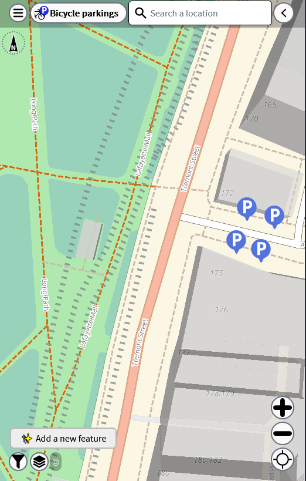
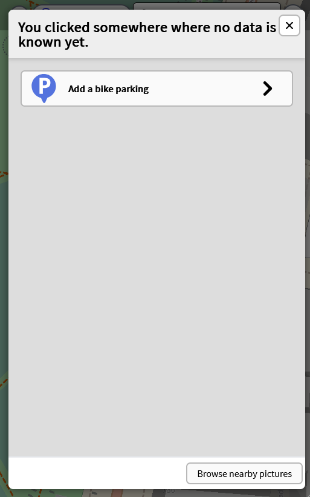
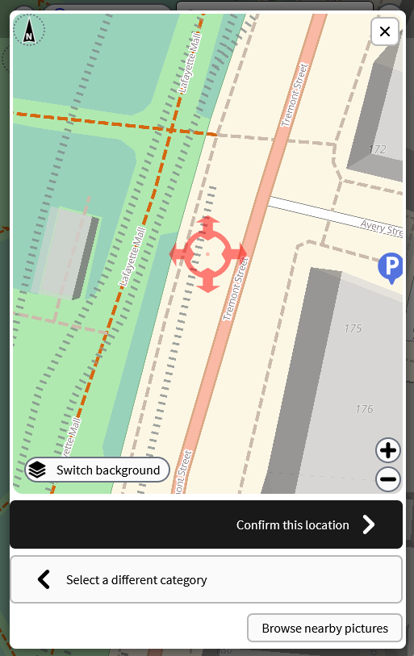
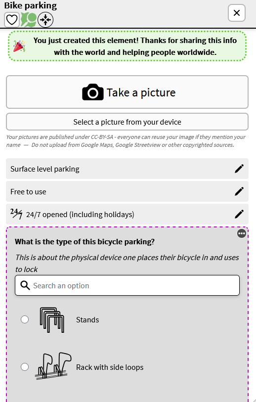
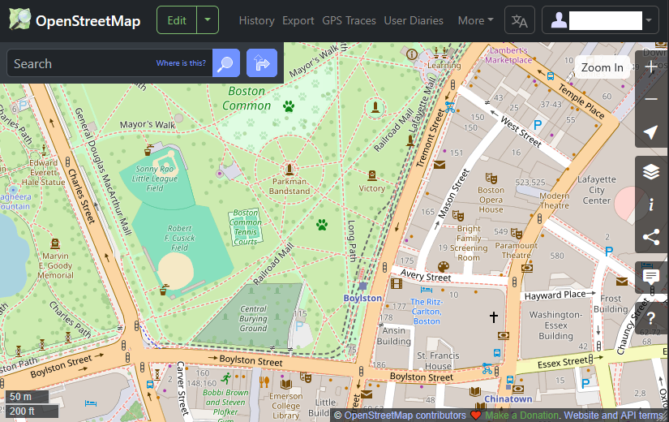
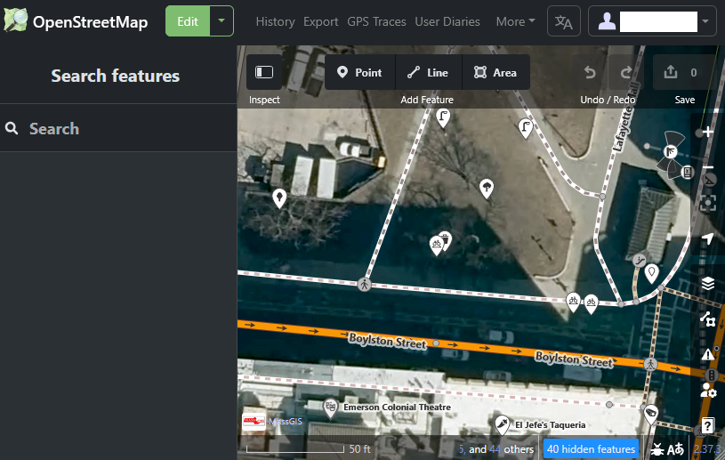
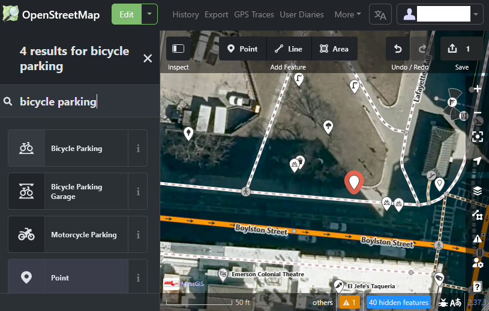
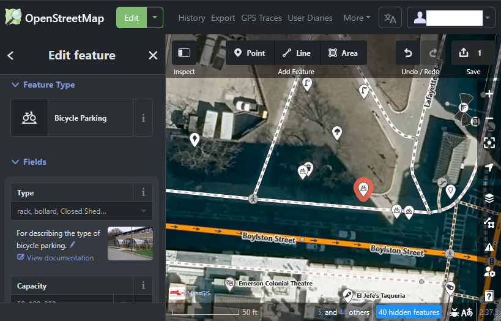
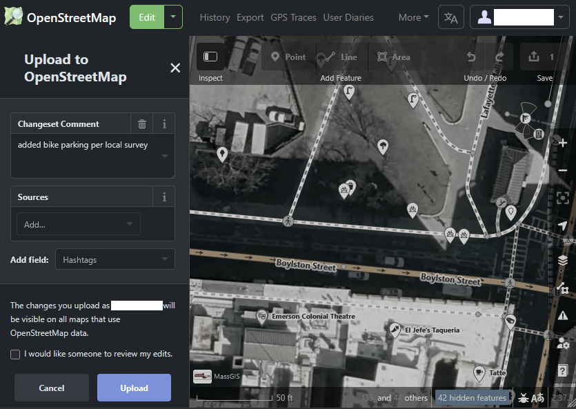

# Why is bike parking important?

There are numerous obstacles that prevent people from choosing to ride a bike for a trip. Many of these can be boiled down to a feeling of safety. You can see our analysis on the comfort of biking on streets on our [Stress Map](https://labs.bostoncyclistsunion.org/stressmap/). But another major obstacle is bike parking. If one doesn't feel that they can safely park their bike at their destination, they won't choose to bike. As you can see in the map below, bike parking is not evenly or thoroughly distributed throughout Boston. This means that there are countless people that aren't able to bike when they otherwise would choose to. Improving this situation is something that each city is more than capable to do, as installing bike racks is simple, cheap, and quick. The Boston Cyclists Union has been advocating for improved bike parking for many years now, included in our [2021 report](https://bostoncyclistsunion.org/wp-content/uploads/2022/01/bcu-parking-study-final.pdf).

Below the map we have instuctions on [how to request new bike racks](#how-to-request-new-bike-parking) and [how to add existing bike racks to this map](#how-to-add-existing-bike-parking-to-this-map). 

	<!-- Embedded stress map -->
	<iframe src="https://bostoncyclistsunion.github.io/LabsWebsiteMap#inx=hidden&bpk=true&blb=false&lts=hidden" height="800px" allowfullscreen allow="fullscreen"></iframe>

# How to request new bike parking

If you know of a specific location that could use a bike rack, we strongly encourage you to request it directly from the controlling jurisdiction. In general, this is the only way to make sure they know exactly where people will use new bike parking. Also, if people consistently request bike parking, this may increase the priority to install more racks faster.  

To help, we have collected below the suggested method to request new bike racks for as many jurisdictions as we can. If you know of something we have missed, please [let us know](https://forms.gle/nnsEZivUxNJYoXih9). You can also always reach out to your elected representatives, getting a bike rack installed can be a cheap and easy win for them.

For private property like your favorite ice cream shop, we recommend talking with the owner/manager. They may defer to the property owner, but in that case you can ask for the proper contact information. Shop owners [regularly over-estimate](https://ggwash.org/view/96602/survey-most-shopkeepers-shoppers-overestimate-car-use) how many people drive to their shops, partially because drivers will complain about the parking conditions. By asking for more and better bike parking, you are also letting the shop know that people are biking to their stores, making them more likely to support other bike improvements in the area.

## Boston

[Boston claims](https://www.boston.gov/departments/boston-bikes/bike-rack-program) to install and repair about 120-160 bike racks per year, but they haven't updated their newly-installed bike rack map since 2020 (as of 3/2/2026).  
  
For Boston, [request a bike rack using this Google form](https://docs.google.com/forms/d/e/1FAIpQLSeePsIpR2s-Fw4oKbZsH8gJwWP1l5GexRCt-TWcKjWt4v3Dgw/viewform), which is on the [bike rack program page](https://www.boston.gov/departments/boston-bikes/bike-rack-program).  The program page indicates they prioritize locations in commercial corridors and in partnership with civic institutions such as libraries and community centers.

## Cambridge

Cambridge installs about 150 new bike racks per year, in addition to requiring new bike racks in many developments. You can learn more about their [bike parking policies here](https://www.cambridgema.gov/CDD/Transportation/GettingAroundCambridge/BikesinCambridge/Parking).

For Cambridge, request a new bike rack using [SeeClickFix](https://www.cambridgema.gov/SeeClickFix) ([web](https://seeclickfix.com/web_portal/WacEfzPx7m29dubrPfXEEwCV/report/category/14028/location), [Android](https://play.google.com/store/apps/details?id=com.seeclickfix.ma.android), [Apple](https://apps.apple.com/us/app/seeclickfix/id322000552)).

## Somerville

The [Somerville Bike Network Plan](https://www.somervillema.gov/content/somerville-bicycle-network-plan) highlights where the city has bike parking and where there are significant gaps in available bike parking. The plan does not include any plans to fix this situation. 

For Somerville, request a new bike rack using [311Somerville](https://www.somervillema.gov/departments/constituent-services/311-service-center) ([web](https://somervillema.qscend.com/311/request/add), [Android](https://play.google.com/store/apps/details?id=com.qscend.report2gov.somerville311), [Apple](https://apps.apple.com/us/app/311somerville/id1086636902)).

## Brookline

The Brookline [Green Routes Master Network Plan](https://www.brooklinema.gov/DocumentCenter/View/18782/Green-Routes-Master-Network-Plan) notes the need for more bike parking, but does not include a plan for installing more bike racks. The town installs new racks based on requests, with funding from the bike improvement budget. In 2026 they expect to install 20-30 new racks.

For Brookline, [request a new bike rack here](https://www.brooklinema.gov/FormCenter/DPW-Engineering-Transportation-11/Bike-Rack-Installation-Request-133).  

## Department of Conservation and Recreation (DCR)

We have found no published way to request new bike parking in areas maintained by DCR. We recommend contacting your elected state representatives and the elected state representatives who represent the area in which you wish to have new racks installed. You can find contact information for elected representatives using the state’s [Find My Legislature tool](https://malegislature.gov/Search/FindMyLegislator). You might also have luck emailing DCR with your request at [mass.parks@mass.gov](mailto:mass.parks@mass.gov).

## Arlington

Arlington Center is designated as a Parking Benefit District, which allocates the revenue from parking meters to improvements of the district. Arlington specifically includes installing new bike racks as a suggested use of this money.

When we reached out to town staff, they recommened trying to request new bike racks using their [roadway safety form](https://www.arlingtonma.gov/town-governance/boards-and-committees/select-board/roadway-safety-request-form) and contacting the [Bicycle Advisory Committee](https://www.arlingtonma.gov/town-governance/boards-and-committees/bicycle-advisory-committee-abac).

# How to add existing bike parking to this map

This map is created from OpenStreetMap (OSM) data. That means that anyone can add bike parking to this map, much like Wikipedia. We update our data for this map every evening, so if you add any new bike parking today in OSM, everyone will see it here tomorrow.

There are many apps that allow you to map features in OSM. Below are a few of the easiest apps to get started and how to specifically use them to add bike parking to OSM.

For all of the options below, you will need an account on OSM. You can [create an account here](https://www.openstreetmap.org/user/new). The table below can help you choose the right instructions based on your preferred platform.

| Web         | Android        | Apple     |
|-------------|----------------|-----------|
| [Map Complete](#map-complete-web) | [StreetComplete](#streetcomplete-android-only) | [EveryDoor](#everydoor-apple-android) |
| [iD](#openstreetmap-id-web)          | [EveryDoor](#everydoor-apple-android)      |           |

## StreetComplete - Android only

[StreetComplete](https://streetcomplete.app/) is a smartphone app for editing OpenStreetMaps and is currently only available for [Android](https://play.google.com/store/apps/details?id=de.westnordost.streetcomplete).  
  
Upon opening the app the map will show your location with nearby objects with questions to be answered highlighted. You can change the default settings to remove the overwhelming number of markers cluttering the map or choose the layers option in the upper right and switch to ‘Thing’ view. Once ‘Thing’ mode is selected the layers menu will be replaced with a green marker symbol and a crosshairs in the center of the screen. Zoom and rotate the map to place the crosshairs at the location to add the new marker and select the red crosshairs button in the lower right to place the new object.

This will prompt you to select the type of object to be placed there and bicycle parking is one of the default options to select from. Select the orange checkmark in the lower right to finalize the addition to the map.

For visual help, scroll horizontally through the screenshots below.	 		 		 			

<section>

	<image-carousel>
		
		<figure>
			

			<!---->
			<figcaption>Basic StreetComplete View</figcaption>
		</figure>
		<figure>
			

			<!---->
			<figcaption>Layers menu</figcaption>
		</figure>
		<figure>
			

			<!---->
			<figcaption>"Things" layer selected</figcaption>
		</figure>
		<figure>
			

			<!---->
			<figcaption>New object creation</figcaption>
		</figure>
		<figure>
			

			<!---->
			<figcaption>New object type selection</figcaption>
		</figure>
		<figure>
			

			<!---->
			<figcaption>New Bicycle Parking created</figcaption>
		</figure>
		
	</image-carousel>

</section>

## EveryDoor - Android/Apple

[EveryDoor](https://every-door.app/) is a smartphone app for adding features, such as bicycle parking, and updating and enhancing details of features, such as capacity of bike parking, to OpenStreetMaps and is available for both [Android](https://play.google.com/store/apps/details?id=info.zverev.ilya.every_door) and [Apple](https://apps.apple.com/us/app/every-door/id1621945342).

Scroll or swipe horizontally on the instructions below to see all of the instructions.

<section>

	<image-carousel>
		
		<figure>
			

			<!---->
			<figcaption style="text-align: left; font-size: medium; margin-bottom: 0.5em;">
			To view where existing bicycle parking is marked in OpenStreetMap, select the tree icon and update the map for your location to show existing features. This view will indicate bike parking if any is nearby along with some other options marked on the map. The image above shows the area at the intersection of Boylston St and Tremont St. Three points marked as bicycle parking are shown on Boylston Street and within the park. Note that the colors for icons may not be the same for each user.
			  
            To add the location of bicycle parking, choose the blue plus sign button in the lower right of the screen. This will prompt you to choose the location to be added. 
			</figcaption>
		</figure>
		<figure>
			

			<!---->
			<figcaption style="text-align: left; font-size: medium; margin-bottom: 0.5em;">
			Once you have moved the pin to the location you would like to add bicycle parking, click the blue checkmark in the lower right corner. 
			</figcaption>
		</figure>
		<figure>
			

			<!---->
			<figcaption style="text-align: left; font-size: medium; margin-bottom: 0.5em;">
			Select ‘Bicycle Parking’ as the type of marker to be added, either by choosing from the common options or by searching for this term in the ‘Choose type…’ search box. 	
			</figcaption>
		</figure>
		<figure>
			

			<!---->
			<figcaption style="text-align: left; font-size: medium; margin-bottom: 0.5em;">
			This will open a prompt about details of the bicycle parking, including: type, capacity, operator, whether the parking is covered, open to the public, free or for a fee, and more. Images can also be added in the “additional options” or “more fields” section which you’ll need to expand at the bottom of the screen. 
			  
            Once you have selected information for the fields you wish to complete, tap the green “Save” button at the bottom of the list. Your contribution is now ready to be submitted to OSM.
			</figcaption>
		</figure>
		<figure>
			

			<!---->
			<figcaption style="text-align: left; font-size: medium; margin-bottom: 0.5em;">
			Follow the previous steps to add as many bike parking locations as you want. Once you have saved your changes, you need to submit your changes to OpenStreetMap. To do so, click the up arrow on the left of the bottom toolbar on the map screen. 
			</figcaption>
		</figure>
		
	</image-carousel>

</section>

## Map Complete - Web

[MapComplete](https://mapcomplete.org) simplifies the interface for adding types of features to OSM with a variety of themes. They have a theme just for [bike parking](https://mapcomplete.org/bicycle_parkings.html?z=12.9&lat=42.351653695129585&lon=-71.06010161014677) and another that includes bike parking and other useful features and [amenities for cyclists](https://mapcomplete.org/cyclofix.html?z=12.6&lat=42.34600576339486&lon=-71.08348986228737). The steps are the same for each, but the instructions below are for the bike parking theme.

On [MapComplete.org](https://mapcomplete.org), select “Cyclofix - A map for cyclists.”  Scroll or swipe horizontally on the instructions below to see all of the instructions.

<section>

	<image-carousel>
		
		<figure>
			

			<!---->
			<figcaption style="text-align: left; font-size: medium; margin-bottom: 0.5em;">
			Once you zoom in enough to the location where you want to add bike parking, click the “Add a New Feature” button in the lower left corner.
			</figcaption>
		</figure>
		<figure>
			

			<!---->
			<figcaption style="text-align: left; font-size: medium; margin-bottom: 0.5em;">
			Click “Add a bike parking”.
			</figcaption>
		</figure>
		<figure>
			

			<!---->
			<figcaption style="text-align: left; font-size: medium; margin-bottom: 0.5em;">
			Drag the map to locate the crosshairs accurately, then click “Confirm this location” in the bottom right corner.
			</figcaption>
		</figure>
		<figure>
			

			<!---->
			<figcaption style="text-align: left; font-size: medium; margin-bottom: 0.5em;">
			Now you are able to add additional details about the bike parking.
			  
            Your changes will be automatically uploaded to OSM.
			</figcaption>
		</figure>
		
	</image-carousel>

</section>

## OpenStreetMap iD - Web

The [OpenStreetMap](https://www.openstreetmap.org/) website has a map editor built-in. This allows you to edit any detail on the OSM map and can be overwhelming when getting started, but adding features like bike parking is very easy.

Scroll or swipe horizontally on the instructions below to see all of the instructions.

<section>

	<image-carousel>
		
		<figure>
			

			<!---->
			<figcaption style="text-align: left; font-size: medium; margin-bottom: 0.5em;">
			To start editing, go to the top left corner and click “Edit”. You will need to log in if you haven’t done so already.
			</figcaption>
		</figure>
		<figure>
			

			<!---->
			<figcaption style="text-align: left; font-size: medium; margin-bottom: 0.5em;">
			Pan and zoom the map to where you want to add new bike parking, then click the "Point" button in the top middle of the map.
			</figcaption>
		</figure>
		<figure>
			

			<!---->
			<figcaption style="text-align: left; font-size: medium; margin-bottom: 0.5em;">
			Place the point by clicking on the map. An empty marker with a red outline will be added to the map. Adjust the exact location by dragging the point. In the left panel, search for and select "bike parking" as the feature type.
			</figcaption>
		</figure>
		<figure>
			

			<!---->
			<figcaption style="text-align: left; font-size: medium; margin-bottom: 0.5em;">
			Once selected, you can add any details about the parking. If you have any questions about appropriate values, you can click the “i” button next to any of the fields to get more information.
			  
            Once you have added details for that parking spot, you can add more parking spots to the map in the same way, or save your features to the map in the top right corner. 
			</figcaption>
		</figure>
		<figure>
			

			<!---->
			<figcaption style="text-align: left; font-size: medium; margin-bottom: 0.5em;">
			When saving, you enter a description of what you changed and hit “Upload”. If you aren’t confident that you made the changes correctly, you can optionally ask for someone to review your edits.
			  
			Congrats! You just edited OpenStreetMap.
			</figcaption>
		</figure>
		
	</image-carousel>

</section>

