# Why is bike parking important?

	<!-- Embedded stress map -->
	<iframe src="https://bostoncyclistsunion.github.io/LabsWebsiteMap#inx=hidden&bpk=true&blb=true&lts=hidden&lts1=true&lts2=true&lts3=true&lts4=true" height="800px" allowfullscreen allow="fullscreen"></iframe>

# How to request new bike parking

## Boston
https://www.boston.gov/departments/boston-bikes/bike-rack-program

The City of Boston provides a google form for requesting the addition of city-installed bike racks on the bike rack program page linked directly.  This program indicates that locations in commercial corridors and in partnership with civic institutions, such as libraries and community centers will be prioritized.

## Cambridge
SeeClickFlix
## Somerville
TBD
## Brookline
TBD
## DCR
TBD

# How to add exsisting bike parking to this map
This map is created from OpenStreetMap (OSM) data. That means that anyone can add bike parking to this map, much like Wikipedia.

There are many apps that allow you to map features in OSM. Below are a few of the easiest apps to get started and how to specifically use them to add bike parking to OSM.

For all of the options below, you will need an account on OSM. You can sign up https://www.openstreetmap.org/user/new 

## StreetComplete - Android only
StreetComplete is a smartphone app for editing OpenStreetMaps and is currently only available for Android
https://streetcomplete.app/

Instructions for how to add new bicycle parking using StreetComplete

Screenshots of the steps described are included below the written instructions.

Upon opening the app the map will show your location with nearby objects with questions to be answered highlighted. You can change the default settings to remove the overwhelming number of markers cluttering the map or choose the layers option in the upper right and switch to ‘Thing’ view. Once ‘Thing’ mode is selected the layers menu will be replaced with a green marker symbol and a crosshairs in the center of the screen. Zoom and rotate the map to place the crosshairs at the location to add the new marker and select the red crosshairs button in the lower right to place the new object.

This will prompt you to select the type of object to be placed there and bicycle parking is one of the default options to select from. Select the orange checkmark in the lower right to finalize the addition to the map.

<section>

	<image-carousel>
		
		<figure>
			

			<!--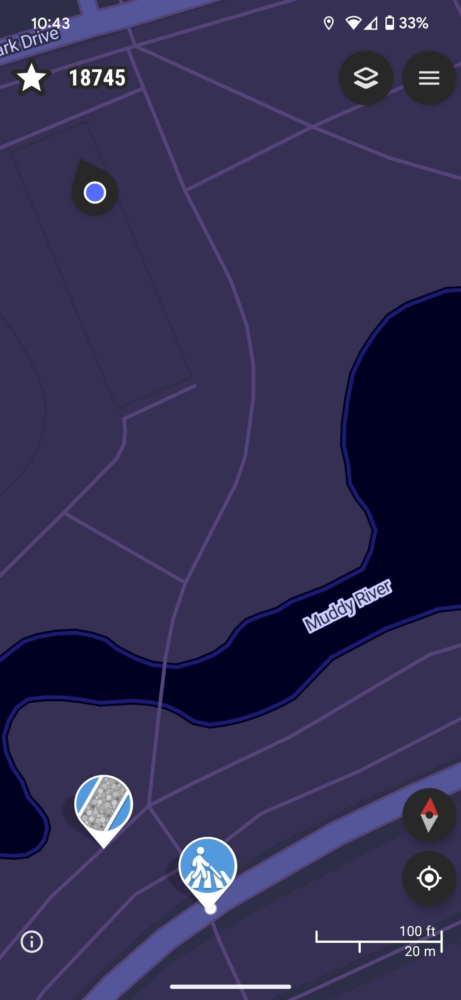-->
			<figcaption>Basic StreetComplete View</figcaption>
		</figure>
		<figure>
			

			<!--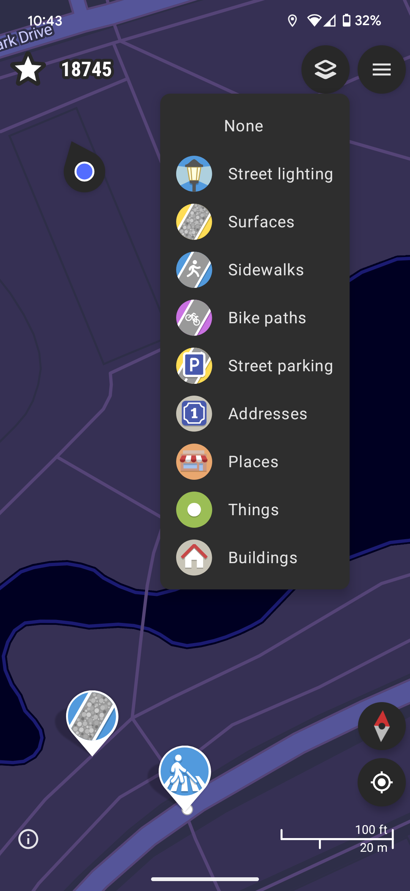-->
			<figcaption>Layers menu</figcaption>
		</figure>
		<figure>
			

			<!--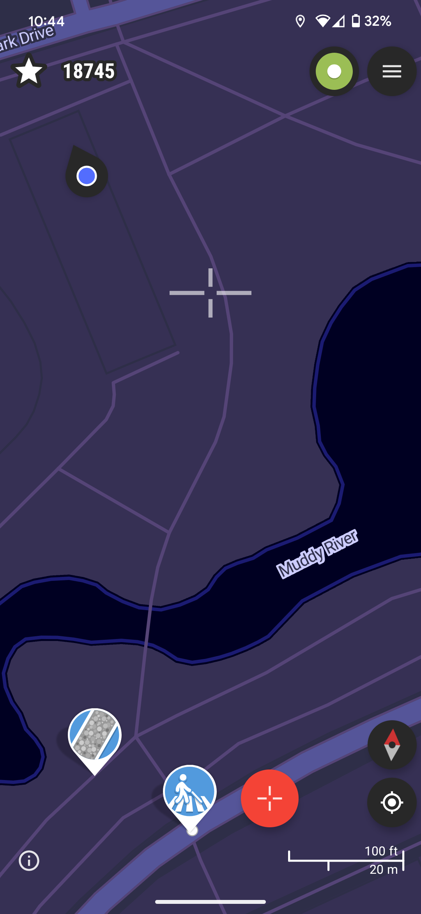-->
			<figcaption>"Things" layer selected</figcaption>
		</figure>
		<figure>
			

			<!--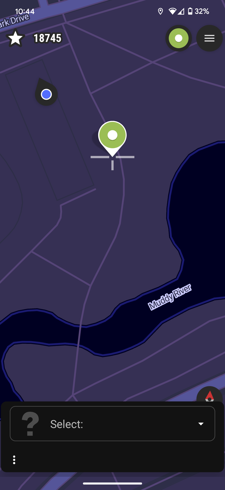-->
			<figcaption>New object creation</figcaption>
		</figure>
		<figure>
			

			<!--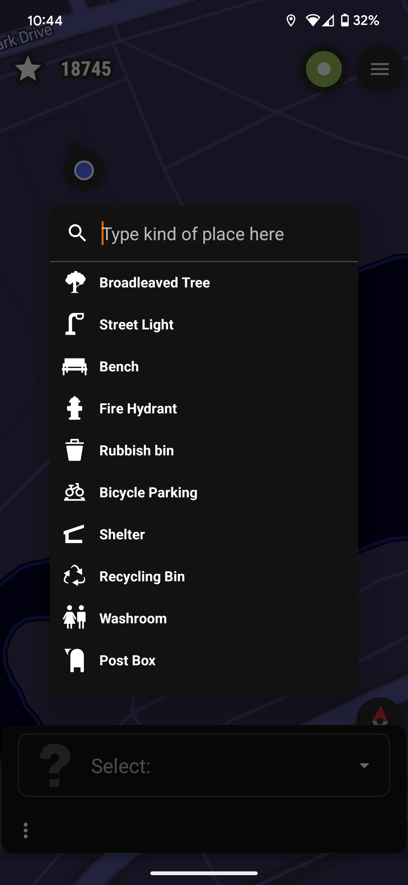-->
			<figcaption>New object type selection</figcaption>
		</figure>
		<figure>
			

			<!--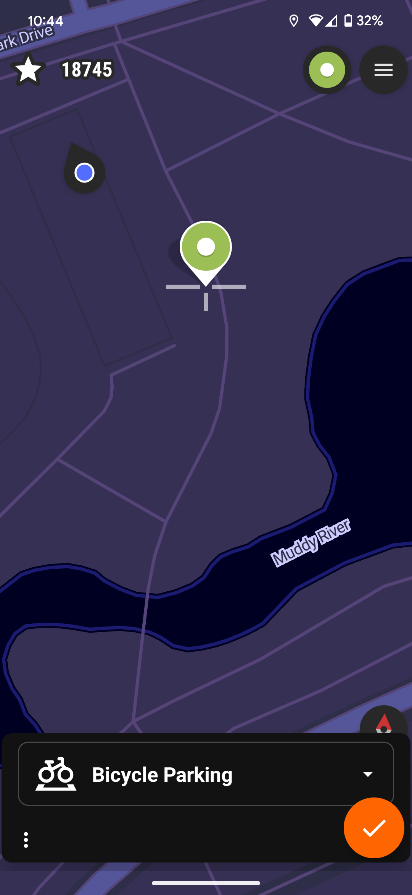-->
			<figcaption>New Bicycle Parking created</figcaption>
		</figure>
		
	</image-carousel>

</section>

## EveryDoor - Apple/Android
Smartphone app for adding features such as bicycle parking to OpenStreet Maps available for both Apple and Android.
https://every-door.app/

### Step-by-step instructions for adding unmapped bike parking
<section>

	<image-carousel>
		
		<figure>
			

			<!--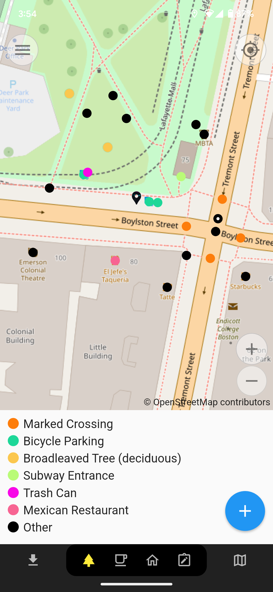-->
			<figcaption>To view where existing bicycle parking is marked in OpenStreetMap, select the tree icon and update the map for your location to show existing features. This view will indicate bike parking if any is nearby along with some other options marked on the map. The image above shows the area at the intersection of Boylston St and Tremont St. Three points marked as bicycle parking are shown on Boylston Street and within the park. Note that the colors for icons may not be the same for each user.
             
            To add the location of bicycle parking choose the blue plus sign button in the lower right of the screen. This will open a new window to prompt to choose the location to be added and is shown below. Once you have moved the pin to the location you would like to add an un-mapped instance of bicycle parking, click the blue checkmark in the lower right.</figcaption>
		</figure>
		<figure>
			

			<!--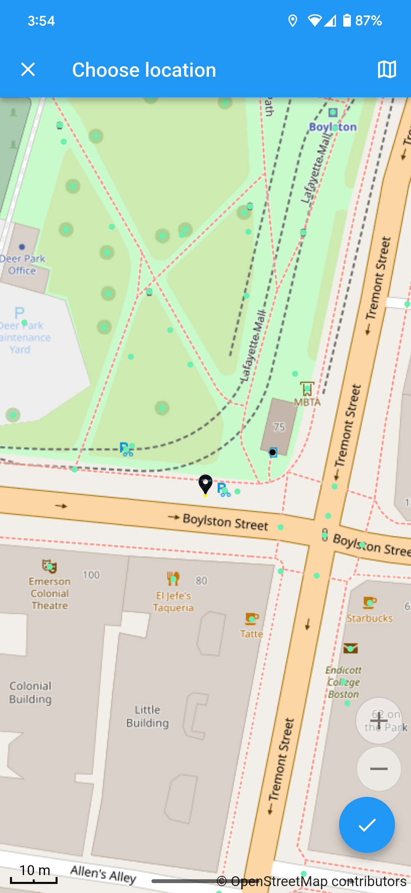-->
			<figcaption>Select ‘Bicycle Parking’ amenity=bicycle_parking as the type of marker to be added either by choosing from the common options or by searching for this term in the ‘Choose type…’ search box</figcaption>
		</figure>
		<figure>
			

			<!--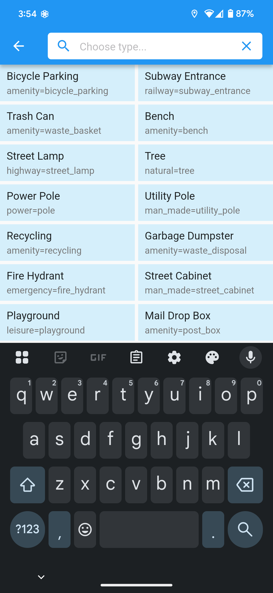-->
			<figcaption>This will open a prompt about details of the bicycle parking including: type, capacity, operator, whether the parking is covered, open to the public, free or for a fee and more. Within the additional options whether the parking is indoor or outdoor, lit by lights, and on a level surface are relevant fields. Images can also be added in the additional options.</figcaption>
		</figure>
		<figure>
			

			<!--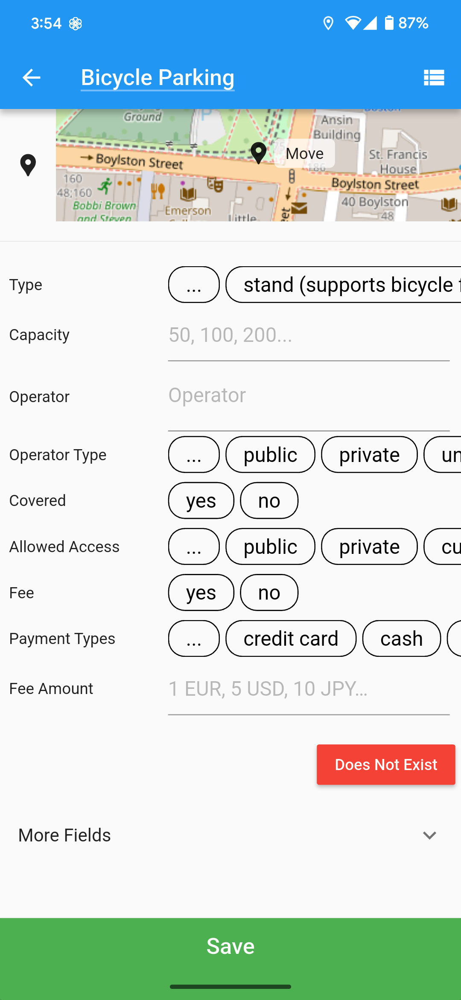-->
			<figcaption>The type of racks installed by the city of Boston are known by several names including post-and-ring lollipop, bollard, post and hoop, post and loop, and are also described by several existing terms in the field type including ‘bollard’, ‘post_hoop’, and ‘post_loop’
             
            Once you have selected information for the fields you wish to complete, choose the green Save button at the bottom of the list and your newly-defined bicycle parking should appear on the map!</figcaption>
		</figure>
		<figure>
			

			<!--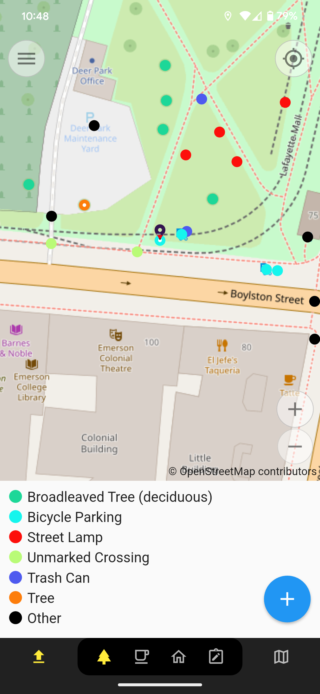-->
			<figcaption>Once you have saved the new bike parking, you need to submit your changes to OpenStreetMap. You can do this by clicking the up arrow on the left of the bottom toolbar on the map screen. You can add multiple items and submit them all at once if you wish.</figcaption>
		</figure>
		
	</image-carousel>

</section>

## Map Complete - Web
https://mapcomplete.org/
MapComplete simplifies the interface for adding types of features (themes) to OSM.They have a theme just for bike parking (https://mapcomplete.org/bicycle_parkings.html?z=12.9&lat=42.351653695129585&lon=-71.06010161014677) and another that includes bike parking and other useful features and amenities for cyclists (https://mapcomplete.org/cyclofix.html?z=12.6&lat=42.34600576339486&lon=-71.08348986228737). The steps are the same for each, but we will focus on just the bike parking theme here.

Once you zoom in enough to the location you want to add bike parking, click the “Add a New Feature” button in the lower left corner. Then click “Add a bike parking”.

Drag the map to locate the crosshairs accurately, then click “Confirm this location” in the bottom right corner.

Now you are able to add additional details about the bike parking.

Your changes will be automatically uploaded to OSM.
## OpenStreetMap iD - Web
https://www.openstreetmap.org/
This is the default editor on the OSM website. To start editing, go to the top left corner and click “Edit”

Once you have logged in, you can add a feature to the map using the buttons in the top center

To add bike parking, choose “Point” and click on the map where the bike parking is located.

Once placed, you can search for the “bike parking” feature type in the left side panel.

Once selected, you can add any details about the parking.

If you have any questions about appropriate values, you can click the “i” button next to any of the fields to get more information.

Once you have added the details you can for that parking spot, you can add more parking spots to the map in the same way or save your features to the map in the top right corner.

When saving, you enter a description of what you changed and hit “Upload”. If you aren’t confident that you made the changes correctly, you can optionally ask for someone to review your edits.

Congrats! You just edited OpenStreetMap. If you added bike parking, you can refresh [link to stressmap] in a few minutes and see it added to our map.

From here, you can learn how to edit existing features and improve the map in other ways. The Stress Map uses OSM data to calculate street ratings. [link to what tags we use for LTS calcs]. Unlike bike parking, any street changes you make will take a few days to appear on our Stress Map, when we recalculate the ratings.

