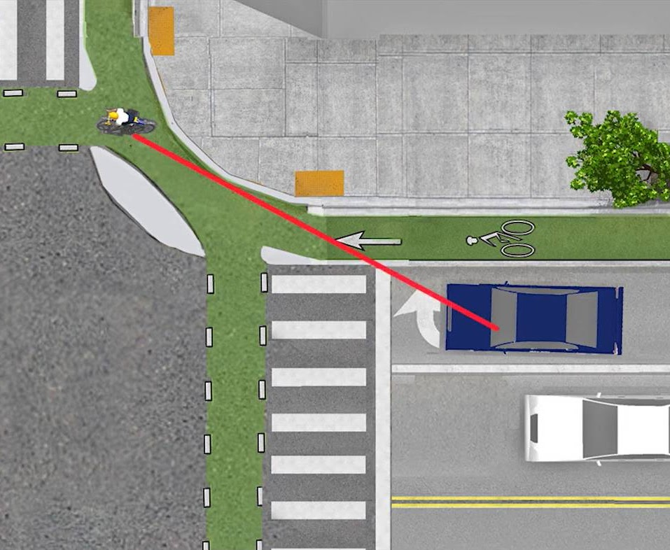
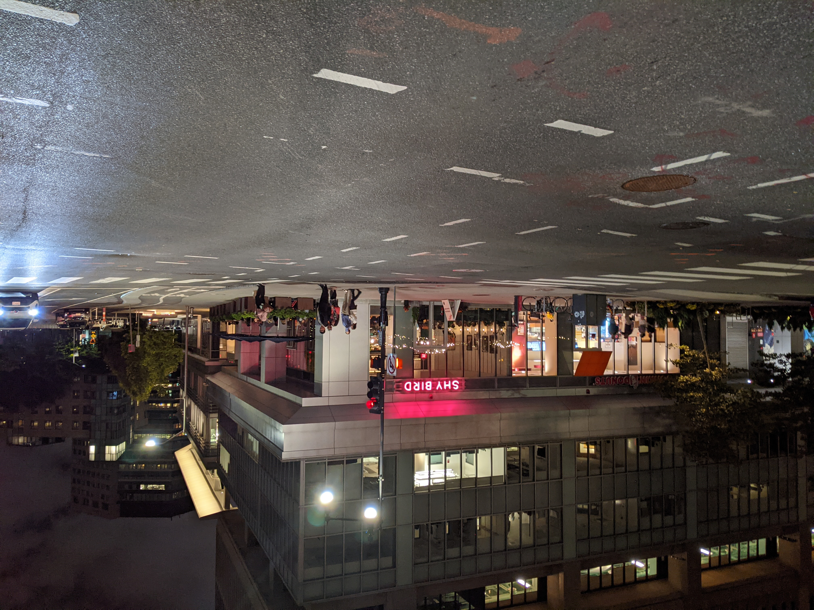
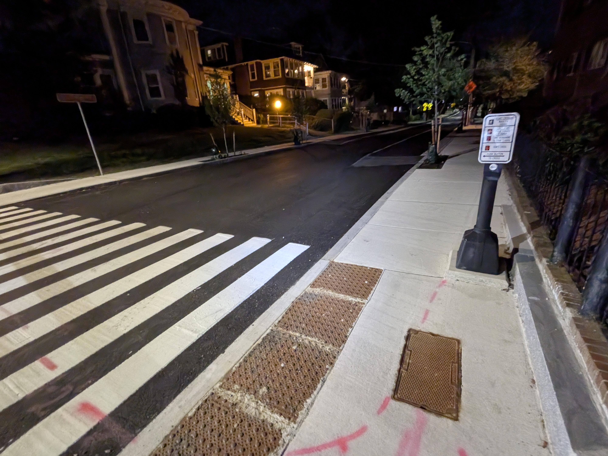
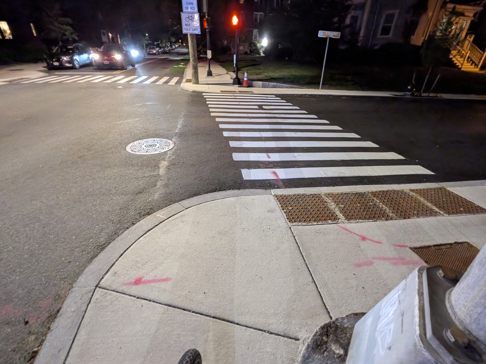

<header>
	<h1>
		Boston Area Forgotten
		 
		<big>Intersections</big>
	</h1>
</header>

<section class="multi-column-row">
	
	

		
		<h2>The problem?</h2>
		

			Many street safety projects have made great safety improvements like physically separating vulnerable road users and calming high traffic speeds.  Unfortunately, many of those improvements stop short of every intersection—despite that being where many of the most severe crashes happen!
		

		

			This map shows intersections on routes where the city or state <strong>built mobility lanes</strong> but left some intersections without:
		

		<ul>
			<li>Corner separation</li>
			<li>Bike lane separation</li>
			<li>Crosswalk separation (a.k.a. “daylighting”)</li>
		</ul>
		
	

	
	<!-- Custom map embed -->
	<iframe columns="3" src="https://www.google.com/maps/d/embed?mid=1UtoQv212WBveh6pdjLJz4oUUPyCvw-g&ehbc=2E312F&noprof=1" style="height: 30rem; /* 480px default */"></iframe>
	
</section>
<section class="multi-column-row">
	

		
		<h2>The solution?</h2>
		
		

			Cities need to go back and build <a href="protectedintersections">protected intersections</a>.  Those work by shifting the curb line to the outside of the bike lane—just like a protected bike lane on the rest of the street.  The intersection stays the same size, and drivers still turn around the same corner radius, but the curb stops them taking it so tight they hit someone in the bike lane or crosswalk before they have a chance to react.
		

		

			Protected intersections can be built out of asphalt or concrete, or they can be built faster with “quick build” materials like flex posts and then upgraded later.
		

		
		<a class="link-button" href="protectedintersections">
			Learn more about protected intersections →
		</a>
		
	

	

		
	

	
</section>
<section class="multi-column-row">
	
	

		
	

	

		
		<h2>Why does it matter?</h2>
		
		

			When a bike lane or crosswalk is right next to a car or truck, it is common for drivers to forget to check their mirrors and “right hook” someone entering the intersection to their right.
		

		

			When a turn is less sharp, it is easier for drivers to turn at high speed, meaning they have less time to react, and it takes them longer to stop.
		

		

			Protected intersections address both those issues:  They separate where drivers and vulnerable road users enter the intersection so drivers can see people in the crosswalk before their paths cross.  And because a barrier prevents drivers cutting the corner or bike lane users going straight through, they all have to slow down more, giving them even more time and space to react and avoid a crash.
		

		
	

	
</section>
<section>

	<image-carousel>
		
		<figure>
			

			<!---->
			<figcaption>Albany St. &amp; Main St., Cambridge</figcaption>
		</figure>
		<figure>
			

			<!---->
			<figcaption>Main St. &amp; Vassar St., Cambridge</figcaption>
		</figure>
		<figure>
			

			<!---->
			<figcaption>Broadway &amp; Third St., Cambridge</figcaption>
		</figure>
		<figure>
			

			<!---->
			<figcaption>Central St. &amp; Summer St., Somerville</figcaption>
		</figure>
		<figure>
			

			<!---->
			<figcaption>Summer St. &amp; Central St., Somerville</figcaption>
		</figure>
		
	</image-carousel>

</section>
<section>
	
	<aside>
		ⓘ Note this map is specifically about streets with safety improvement projects that fell short.  For more about streets that haven't received <em>any</em> micromobility safety improvements—check out our <a href="https://landway.BostonCyclistsUnion.org" target="_blank">Landway</a> and <a href="../map">Stress Map</a> projects!
	</aside>
	
</section>

