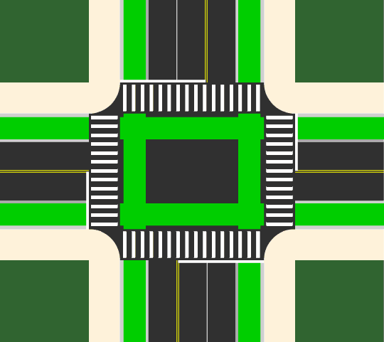

<header style="margin-inline-start: 0;">
	<h1>
		Boston Area Forgotten
		 
		<big>Intersections</big>
	</h1>
</header>

<section class="multi-column-row">
	
	

		
		<h2>The problem?</h2>
		

			Many street safety projects have made great safety improvements like physically separating vulnerable road users and calming high traffic speeds.  Unfortunately, many of those improvements stop short of every intersection—despite that being where many of the most severe crashes happen!
		

		

			This map shows intersections on routes where the city or state <strong>built mobility lanes</strong> but left some intersections without:
		

		<ul>
			<li>Corner separation</li>
			<li>Bike lane separation</li>
			<li>Crosswalk separation (a.k.a. “daylighting”)</li>
		</ul>
		
	

	
	<iframe columns="3" src="https://www.google.com/maps/d/embed?mid=1UtoQv212WBveh6pdjLJz4oUUPyCvw-g&ehbc=2E312F" style="height: 30rem; /* 480px default */"></iframe>
	
</section>
<section class="multi-column-row">
	

		
		<h2>The solution?</h2>
		
		

			Cities need to go back and build <a href="protectedintersections">protected intersections</a>.  Those work by shifting the curb line to the outside of the bike lane—just like a protected bike lane on the rest of the street.  The intersection stays the same size, and drivers still turn around the same corner radius, but the curb stops them taking it so tight they hit someone in the bike lane or crosswalk before they have a chance to react.
		

		

			Protected intersections can be built out of asphalt or concrete, or they can be built faster with “quick build” materials like flex posts and then upgraded later.
		

		
		<a class="link-button" href="protectedintersections">
			Learn more about protected intersections →
		</a>
		
	

	

		
	

</section>
