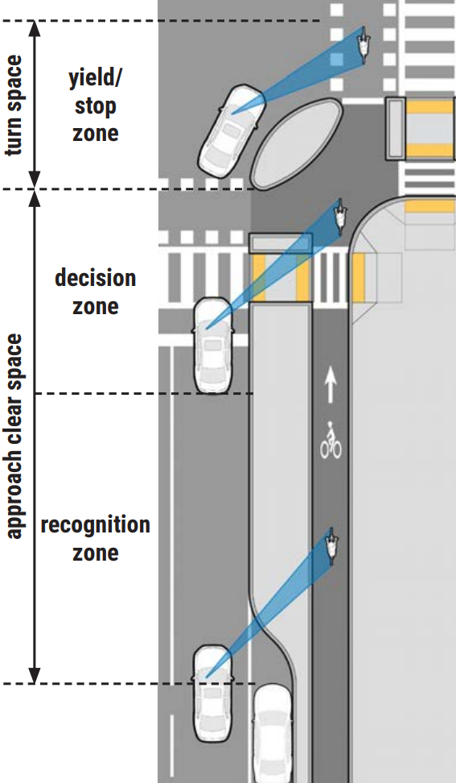
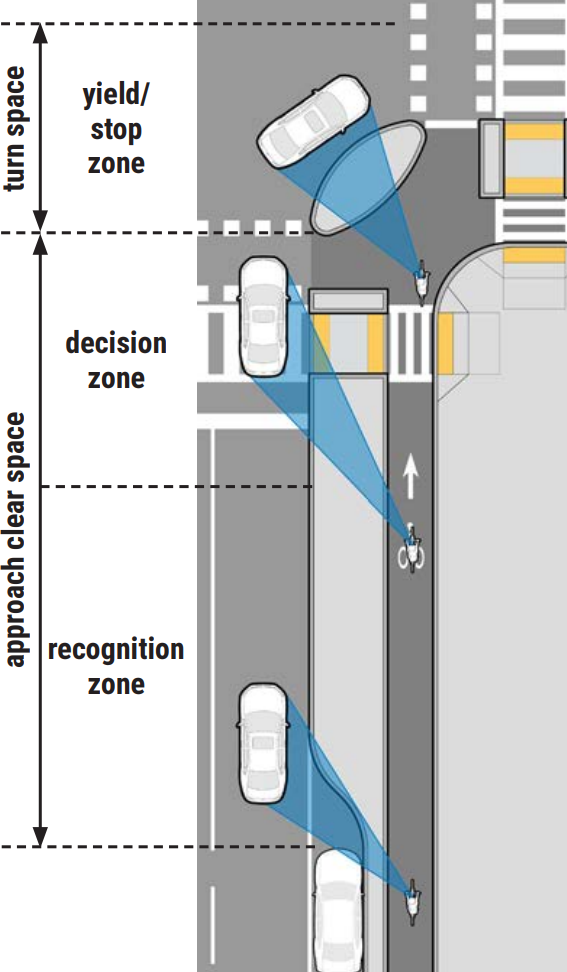
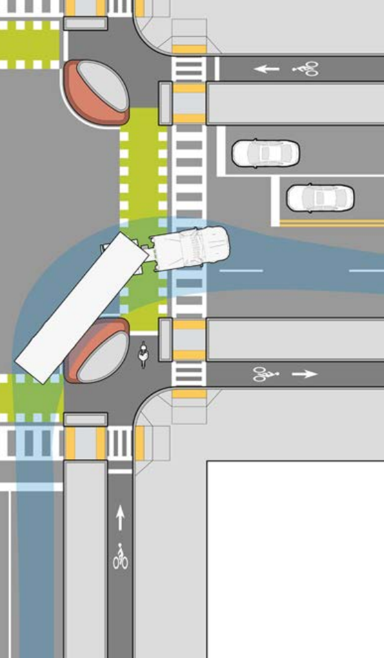

<header>
	<h1>
		What Are Protected Intersections?
	</h1>
</header>

<section>
	
	<h2 style="margin-bottom: 0.25rem;">
		Just like protected bike lanes...
	</h2>
	

		...use physical barriers to keep heavy motor vehicles separate from vulnerable road users, protected intersections use similar barriers to minimize how much space vulnerable road users and heavy motor vehicles need to share in intersections.  And they do this <strong>without taking up any more space than a classic intersection!</strong>
	

	
</section>

 

<section class="multi-column-row">
	

		
		<h2>How do you convert a classic intersection?</h2>
		
		<ol>
			<li>
				Keep the same corner curve (since we already know that curve works for vehicles making that turn), but move it to the outside of the bike lane.
			</li>
			<li>
				Shift the crosswalks and crossbikes back so they are outside the middle of the intersection.
			</li>
			<li>
				Add a barrier between where the bike lane wraps around the corner and the rest of the intersection.
			</li>
		</ol>
		
		 
		<aside>
			The details can vary street to street depending on angles and street parking, but it can be that easy!
		</aside>
		
	

	

		
	

	
</section>

 

<section>
	
	

		<a href="https://www.mass.gov/doc/chapter-4-intersection-design-0/download" target="_blank">MassDOT's Separated Bike Lane Intersection Design Guide</a> highlights some particular safety benefits of this type of design:
	

	
	

		
		<figure columns="1">
			
			<figcaption>
				Placing bike lane users farther to drivers' right gives more chance to see them and avoid a “right hook”
			</figcaption>
		</figure>
		<figure columns="1">
			
			<figcaption>
				Even if a driver fails to signal, the protected corner gives a bike lane user more time to see the right turn
			</figcaption>
		</figure>
		<figure columns="1">
			
			<figcaption>
				When larger vehicles are involved, protected corners keep bike lane users out of danger zones
			</figcaption>
		</figure>
		
	

	
</section>

 

<section>
	<h2>Full construction or “quick build”</h2>
	
	

		Like other infrastructure, protected intersection elements can be built with “quick build” materials like flex posts or premade curb segments to provide an immediate safety improvement for vulnerable road users, and then later upgraded to more durable (and aesthetically nicer) materials like asphalt, concrete, brick, or stone.
	

	

		Here are how some different separated corners around the area guide mixed traffic around the corner while directing bike lane and sidewalk users within it.
	

	
	

		

		
			<h3>As a driver...</h3>
			
			<image-carousel>
				
				<figure>
					

					<!---->
					<figcaption>Full construction separated corner at Broadway & Galileo (Kendall Square)</figcaption>
				</figure>
				<figure>
					

					<!---->
					<figcaption>Full construction separated corner at Mass Ave. & Boylston (Back Bay)</figcaption>
				</figure>
				<figure>
					

					<!---->
					<figcaption>Quick build separated corner at Grand Union & Foley (Assembly Square)</figcaption>
				</figure>
				<figure>
					

					<!---->
					<figcaption>Quick build separated corner at Hampshire & Portland (Kendall Square, built in response to Minh-Thi Nguyen being killed with a truck)</figcaption>
				</figure>
				<figure>
					

					<!---->
					<figcaption>Quick build separated corner at Boylston & Ipswich (under construction, Fenway)</figcaption>
				</figure>
				<figure>
					

					<!---->
					<figcaption>Full construction separated corner at Columbus Ave. & Ruggles Busway</figcaption>
				</figure>
				<figure>
					

					<!---->
					<figcaption>Full construction separated corner at N. Washington St. & Chelsea St. (under construction)</figcaption>
				</figure>
				
			</image-carousel>
			
		

		

		
			<h3>As a vulnerable road user...</h3>
			
			<image-carousel>
				
				<figure>
					

					<!---->
					<figcaption>Full construction separated corner at Broadway & Galileo (Kendall Square)</figcaption>
				</figure>
				<figure>
					

					<!---->
					<figcaption>Full construction separated corner at Mass Ave. & Boylston (Back Bay)</figcaption>
				</figure>
				<figure>
					

					<!---->
					<figcaption>Quick build separated corner at Grand Union & Foley (Assembly Square)</figcaption>
				</figure>
				<figure>
					

					<!---->
					<figcaption>Quick build separated corner at Hampshire & Portland (Kendall Square, built in response to Minh-Thi Nguyen being killed with a truck)</figcaption>
				</figure>
				<figure>
					

					<!---->
					<figcaption>Quick build separated corner at Boylston & Ipswich (under construction, Fenway)</figcaption>
				</figure>
				<figure>
					

					<!---->
					<figcaption>Full construction separated corner at Columbus Ave. & Ruggles Busway</figcaption>
				</figure>
				<figure>
					

					<!---->
					<figcaption>Full construction separated corner at N. Washington St. & Chelsea St. (under construction)</figcaption>
				</figure>
				
			</image-carousel>
		

	

</section>

 

<section>
	
	

		These videos explain more about how protected intersections make our streets safer for pedestrians, bicyclists, and other vulnerable road users:
	

	
	

		
		<iframe columns="1" src="https://player.vimeo.com/video/86721046" width="640" height="360" frameborder="0" referrerpolicy="strict-origin-when-cross-origin" allow="autoplay; fullscreen; picture-in-picture; clipboard-write; encrypted-media; web-share"   allowfullscreen></iframe>
		
		<iframe columns="1" src="https://www.youtube.com/embed/FlApbxLz6pA" width="640" height="360" frameborder="0" allow="accelerometer; autoplay; clipboard-write; encrypted-media; gyroscope; picture-in-picture; web-share" referrerpolicy="strict-origin-when-cross-origin" allowfullscreen></iframe>
		
	

	
</section>

