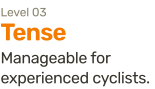
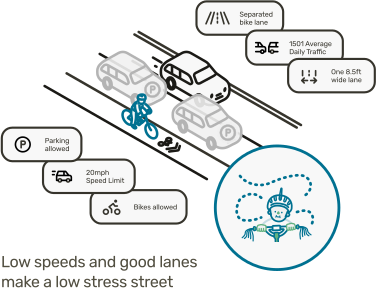
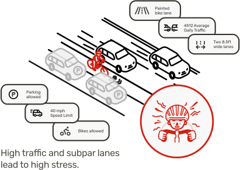

# What is Level of Traffic Stress?

## A method for assessing how bike-friendly a street truly is.

Level of Traffic Stress is a system developed in part by [Northeastern University's Professor Peter Furth](https://peterfurth.sites.northeastern.edu/2014/05/21/criteria-for-level-of-traffic-stress) to capture how stressful or comfortable a street feels for cyclists.  While a painted bike lane might look bike-friendly on a map, factors like fast and heavy traffic can still make it stressful.  The Level of Traffic Stress system considers these elements to give cyclists and planners a clearer view of which routes are truly comfortable.

The Level of Traffic Stress system categorizes streets into the following four levels:

<figure class="multi-column-row" style="flex-wrap: nowrap;">
	

		
		
	

	

		
		
	

	

		
		
	

	

		
		
	

</figure>

# How does this map work?

## The map analyzes road and traffic data to rate a street's bike friendliness.

[We use data from OpenStreetMap (OSM)](../../osm/), an open-source online map that people around the world help build and update.  Each street segment is tagged with details such as speed limit, traffic, etc., which we use to calculate a Level of Traffic Stress for each street segment.

<figure class="multi-column-row" style="flex-wrap: nowrap;">
	
	
</figure>

## What can you do with this tool?

- Explore the connectivity of the streets in your neighborhood
- Find new, more comfortable ways to travel around Greater Boston
- Learn about the design elements that contribute to stress levels
- Identify ways streets you (want to) use could be redesigned to be safer and less stressful

	<a class="link-button" href="/map/">See streets in your neighborhood!</a>

# A deep dive into Level of Traffic Stress

Our Stress Map is based on a heuristic concept called [Level of Traffic Stress (LTS)](https://peterfurth.sites.northeastern.edu/2014/05/21/criteria-for-level-of-traffic-stress).  This has been developed in part by Professor Peter Furth of Northeastern University (who is also a Boston Cyclists Union Board Member).  LTS is commonly used by planning and engineering professionals.

Our implementation attempts to calculate the most current version, v2.2.  This version uses many factors of the street design to categorize streets.  Unfortunately, our primary data source, OSM, does not have all of the necessary data tagged for each street segment.  Engineers could manually collect data for individual street improvement projects to accurately rate a street segment, but to achieve a regional map, we make educated assumptions on what the street looks like.  If you see something wrong, [learn how to fix the data here]({{ site.baseurl }}/osm).

	<a class="link-button" href="/osm/">How we use OSM data</a>

The big idea with LTS is that there is more to a cyclist's experience on a street than whether or not there is a bike lane.  There are numerous streets that have bike lanes that an experienced cyclist in the city may know to avoid.  On the other hand, many quiet residential streets have no bike-specific markings and may be the exact streets that someone uses to avoid the high speed, high volume street with a bike lane.  This means if we want to compare streets based on the comfort to ride on them, we need to look at more of the features of the street than just the presence of a bike lane.

What makes cycling dangerous is the presence, proximity, volume, and speed of cars and trucks.  A bike lane can help position cyclists and drivers into different spaces on the street.  But what if the bike lane is adjacent to parked cars in a way that increases the risk of getting [“doored”](https://en.wikipedia.org/wiki/Dooring) (hit by a passenger opening a vehicle door)?  Separating a bike lane with physical barriers like concrete or flex-posts further increases the separation and therefore comfort of cycling on a street.  For streets with high traffic volumes and high-speed traffic, increasing physical bike lane separation becomes more critical to building a street that is inviting to cycle on.

On streets where there isn't enough space to build high-quality bike lanes, the city can reduce conflicts with cars by reducing the speed that people can drive, and/or the volume of traffic.  This is called [traffic calming](https://en.wikipedia.org/wiki/Traffic_calming) and there are numerous tools to make a street safer this way.  A popular traffic calming option recently has been [speed humps](https://nacto.org/publication/urban-street-design-guide/street-design-elements/vertical-speed-control-elements/speed-hump), which Boston has been installing as part of their [Safety Surge](https://mass.streetsblog.org/2023/05/22/wu-admin-announces-safety-surge-of-traffic-calming-for-neighborhood-streets) effort.
